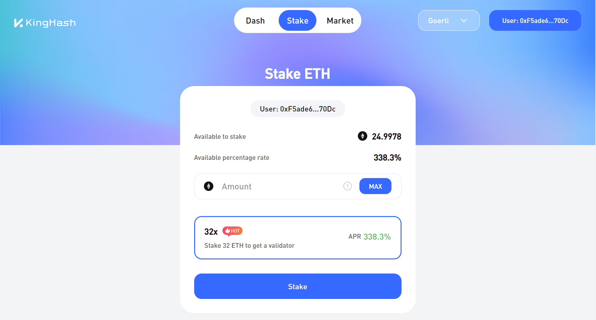

# KingHash Aggregator


<!--
| Statements                  | Branches                | Functions                 | Lines             |
| --------------------------- | ----------------------- | ------------------------- | ----------------- |
|  |  |  |  |
-->

This repository contains the core smart contracts for the [KingHash Aggregator Protocol](https://www.kinghash.com/). KingHash Aggregator Protocol is a smart contract for various Eth staking strategies. KingHash Aggregator Protocol is currently already integrated to the suite of products [ChainUp Cloud](https://docs.chainupcloud.com/) offers.

**Overview**

* [Architecture](./docs/architecture.md)
* [Aggregator](./docs/aggregator.md)
* [ValidatorNFT](./docs/validatorNFT.md)

You can find more generic information about KingHash Aggregator over [here](https://docs.chainupcloud.com/introduction/products/kinghash-aggregator).



# Quick Commands

Try running some of the following tasks:

```shell
npx hardhat help
npx hardhat test
GAS_REPORT=true npx hardhat test
npx hardhat node
npx hardhat run scripts/deploy.ts --network goerli
npx hardhat run scripts/upgrade.ts --network goerli
npx hardhat clean
npx hardhat coverage
```

# Setting Up

1. Ensure you have installed `node ^v16.14.2` and `npm ^8.5.0`. We recommend using `nvm` to install both `node` and `npm`. You can find the `nvm` installation instructions [here](https://github.com/nvm-sh/nvm#installing-and-updating).
2. Run `npm install` to install the dependencies.
3. Run `npx hardhat compile` to compile the code.
4. Run `npx hardhat clean` when you run into issues.
5. Run `npx hardhat test` to run the tests.

# Deploy

Pre-requisite:

Setup your `.env` with the following keys:

```
GOERLI_URL=https://goerli.infura.io/v3/<YOUR_INFURA_API_KEY>
GOERLI_PRIVATE_KEY=<YOUR_PRIVATE_KEY>
ETHERSCAN_KEY=<YOUR_ETHERSCAN_API_KEY>
```

1. The deploy order is NFTContract > Vault > Aggregator.
2. Run `npx hardhat run scripts/deployNft.ts --network goerli` to deploy the NFT Contract on Goerli.
3. Note down the `ValidatorNft.sol` address and update it in both `./scripts/deployNodeRewardVault.ts` and `./scripts/deployAggregator.ts`.
4. Run `npx hardhat run scripts/deployNodeRewardVault.ts --network goerli` to deploy the Node Reward Vault Contract on Goerli.
5. Note down the `NodeRewardVault.sol` proxy's address and update it into the `./scripts/deployAggregator.ts`.
6. Run `npx hardhat run scripts/deployLidoController.ts --network goerli` to deploy the Lido Controller Contract on Goerli.
7. Note down the `LidoController.sol` proxy's address and update it into the `./scripts/deployAggregator.ts`.
8. Run `npx hardhat run scripts/deployRocketController.ts --network goerli` to deploy the Rocket Controller Contract on Goerli.
9. Note down the `RocketController.sol` proxy's address and update it into the `./scripts/deployAggregator.ts`.
10. Run `npx hardhat run scripts/deployAggregator.ts --network goerli` to deploy the Aggregator Contract on Goerli.
11. Note down the `Aggregator.sol` proxy's address and interact with the `ValidatorNft.sol`, `NodeRewardVault.sol`, `LidoController.sol` and `RocketController.sol` to update them.

# Other Tools

## Coverage

To get code coverage do `npx hardhat coverage`.

The html files inside `/coverage` folder will tell you what's missing coverage. You can use Coverage Gutter plugin on VSCode to facilitate this.

We want 100% coverage on any smart contract code that gets deployed. If code doesn't need to be used, it should not be there. And whatever code does exist in the smart contract needs to be run by the tests.

To generate the coverage badge, run `npm run make-badges` after running coverage. It generates the badge from `coverage/coverage-summary.json`.

## Slither - Security Analyzer

`pip3 install slither-analyzer` and
`slither .` inside the repo.

We also recommend to install the [slither vscode extension](https://marketplace.visualstudio.com/items?itemName=trailofbits.slither-vscode).

Run it after major changes and ensure there arent any warnings / errors.

To disable slither, you can add `// slither-disable-next-line DETECTOR_NAME`.

You can find `DETECTOR_NAME` [here](https://github.com/crytic/slither/wiki/Detector-Documentation).

## Mythril - Fuzz tests

`pip3 install mythril`

Run `myth analyze ./contracts/Aggregator.sol --solc-json mythril.json --solv 0.8.7` to begin analyze. Note that this process can take a **very** long time.

You can run with `myth analyze ./contracts/Aggregator.sol --solc-json mythril.json --solv 0.8.7 --execution-timeout 3000` to limit the analyzation time. But the testing will not be as thorough.

You can see further instructions for Mythril [here](https://github.com/ConsenSys/mythril).

## Surya - GraphViz for Architecture

Install Surya using : `npm install -g surya`

To create a graphviz summary of all the function calls do, `surya graph contracts/**/*.sol > FM_full.dot` and open `FM_full.dot` using a graphviz plugin on VSCode.

`surya describe contracts/**/*.sol` will summarize the contracts and point out fn modifiers / payments. It's useful to get an overview.

You can see further instructons for Surya [here](https://github.com/ConsenSys/surya).


# Contracts 
## Goerli
[Aggregator Proxy](https://goerli.etherscan.io/address/0x789983D968074df2395608700C561D4AD959f189#code): `0x789983D968074df2395608700C561D4AD959f189`

[NodeRewardVault Proxy](https://goerli.etherscan.io/address/0xD78736E9EE9895A0a35AB19163Bd1A94E72dea3e#code): `0xD78736E9EE9895A0a35AB19163Bd1A94E72dea3e`

[NodeCapitalVault Proxy](https://goerli.etherscan.io/address/0xb82fD8ecD2Ca4bb6701598B7D4f1a937bF41363A#code): `0xb82fD8ecD2Ca4bb6701598B7D4f1a937bF41363A`

[vNFT](https://goerli.etherscan.io/address/0xdE6Ff11aD8CD771Ebb43509987E3013b1bEC027F#code): `0xdE6Ff11aD8CD771Ebb43509987E3013b1bEC027F`

[LidoController Proxy](https://goerli.etherscan.io/address/0x20C823d65d56d8540a3b6a937fD309086a4110F5#code): `0x20C823d65d56d8540a3b6a937fD309086a4110F5`

[RocketController Proxy](https://goerli.etherscan.io/address/0xc5a36c9D3ED8620fa1AaAad00D263FeAbda3f03d#code): `0xc5a36c9D3ED8620fa1AaAad00D263FeAbda3f03d`

[TimelockController](https://goerli.etherscan.io/address/0xd0D6AD5117A27678Cb79fa848eE59192364D5fbA#code): `0xd0D6AD5117A27678Cb79fa848eE59192364D5fbA`

## Ethereum
[Aggregator Proxy](https://etherscan.io/address/0x447c3ee829a3B506ad0a66Ff1089F30181c42637#code): `0x447c3ee829a3B506ad0a66Ff1089F30181c42637`

[vNFT](https://etherscan.io/address/0x40Cd77D9aa9e0b2D485259415eA05486B201c514#code)：`0x40Cd77D9aa9e0b2D485259415eA05486B201c514`

[NodeRewardVault Proxy](https://etherscan.io/address/0xade4A1e54a0efA7c0557e8fdecC714F716eD0Be6#code): `0xade4A1e54a0efA7c0557e8fdecC714F716eD0Be6`

[NodeCapitalVault Proxy](https://etherscan.io/address/0x23715A59BEd8A94AA4FFebE8B7f1125b84FE970a#code)：`0x23715A59BEd8A94AA4FFebE8B7f1125b84FE970a`

[TimelockController](https://etherscan.io/address/0x01D0Be6a499F91a4572F78F042D0f7a1FdE1EbcE#code)：`0x01D0Be6a499F91a4572F78F042D0f7a1FdE1EbcE`

[KingHash multisig](https://etherscan.io/address/0x6b8caCEc8A29A356589dBAacd51C67cc4c2766ce#code)： `0x6b8caCEc8A29A356589dBAacd51C67cc4c2766ce`

# Audits
The following auditors were engaged to review the project before launch:
* [Beosin Audit](https://beosin.com/) (In Progress)