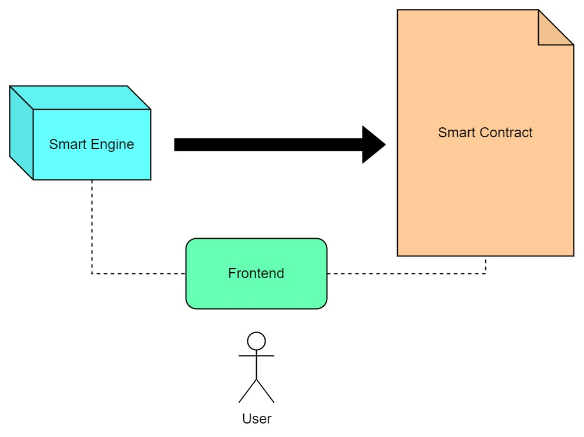
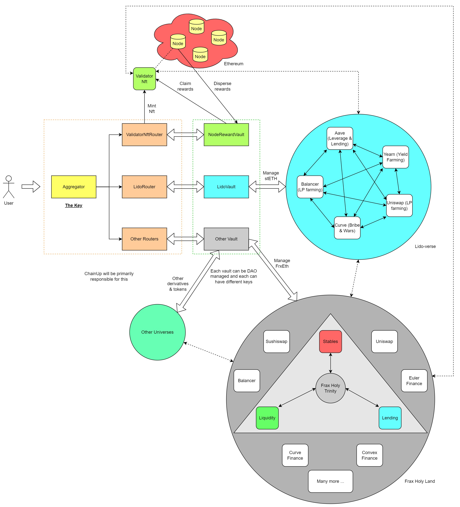
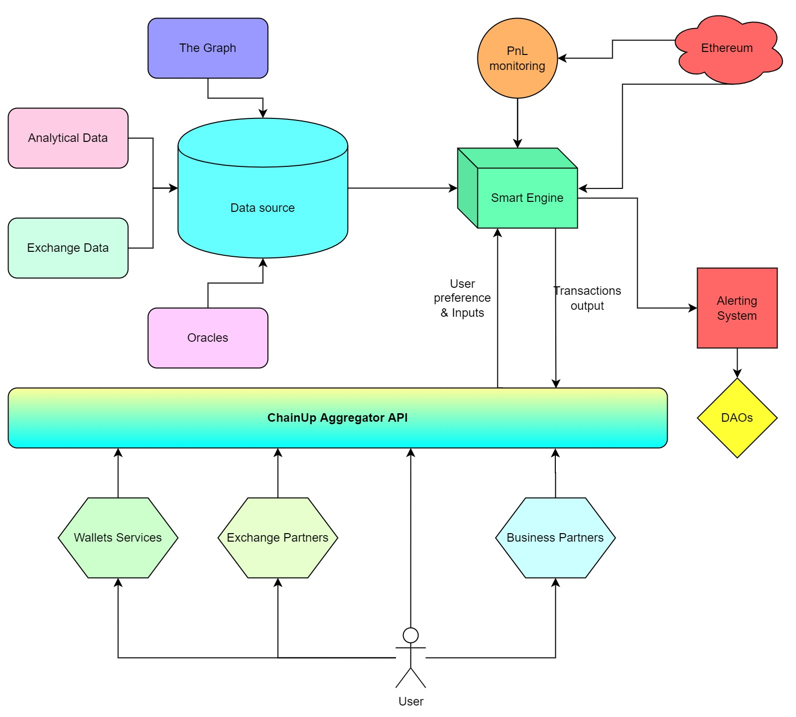
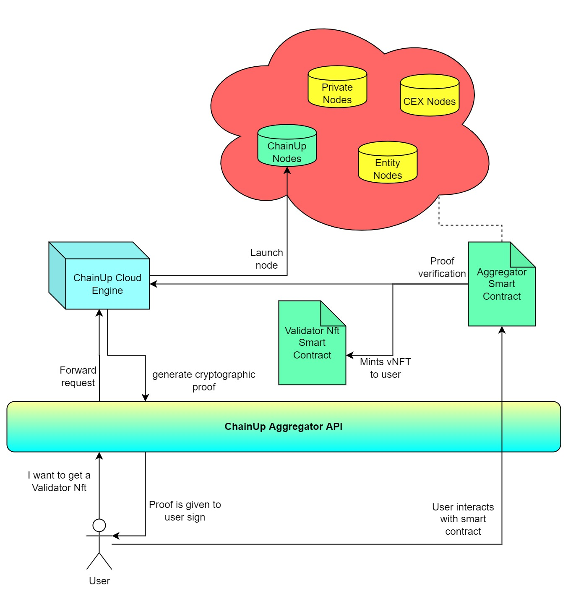

This is a brief introduction to KingHash Aggregator and Validator NFT, KingHash Aggregator the first staking aggregator protocol and Validator NFT is a novel mechanism for Ethereum staking offered by KingHash. 

Just like any other aggregator protocols, the goal of aggregator is to **aggregate over something**. Decentralized Exchange Aggregators like [1inch](https://app.1inch.io/) provide users with the best trade, and Yield Aggregators like [Yearn Finance](https://yearn.finance/) aims to maximize yield returns. For a Staking Aggregator like [KingHash Aggregator](https://www.kinghash.com/), it does both! It finds the best way to stake your assets, and compound your yield! 💎

There are various staking protocols for staking Eth on the Ethereum network. KingHash Aggregator aggregates over various staking protocols on the Ethereum Network. From the user's persepctive, it is simply a one-click staking protocol that will help users to stake their Eth across existing protocols and compound the yields using various strategies based on the user's risk profile & preference. 🧸

Validator NFT deals with the problem of the technical know-how user need just to stake Eth. From generating `depositData`, and operating a validator node; these are all extremely high barriers of entries to most people. The Validator NFT works by automatically creating a node on behalf of the user, and submitting a cryptographic proof onto the chain to represent the user ownership. In exchange, the user is given a NFT which reflects the underlying validator node.

# Features
The KingHash Aggregator interfaces with a variety of staking protocols on Ethereum:
 * Validator NFTs
 * Lido
 * Rocket Pool
 * Stakewise
 * Frax
 * Swell
 * SSV Network
 * Obol Network
 * Safestake Network
 * And More

# Architecture
The KingHash Aggregator consists of 2 major components:
1. The Smart Contract for fund management & network interaction
2. The Smart Engine that strategize, recommend and utilize the Smart Contract

The Smart Contract component is required to interface with all existing staking contracts, keeping track of various states & ownerships, and executing yield strategies. Anyone can interact with our Smart Contract as long as they understand the specifcation required.

The Smart Engine component is an implementation (in which we provide) to interact with our Smart Contract. The Smart Engine can be completely swapped out to your own implementation; and you will suggest your own strategies and be responsible for interfacing.

Here's a diagram to illustrate a simple overview:

## Smart Contract
The Smart Contract is broken down into several contracts. The Aggregator Contract is the single main entry point. It will route the Eth to various staking protocols and execute various strategies based on the input provided.

And depending on the user's input, they may recieve Fungible Tokens (such as stETH, Share tokens) and Non-Fungible Tokens (Validator NFTs, Swell NFTs). If the user chooses fund related strategies, underlying assets can be re-invested, and all asset holdings will be govern by the DAO in their respective vault contracts.

The diagram only shows a fraction of the stuff you can do **just by** staking your Eth. Even a professional Defi analyst will struggle to manage their Eth over all these various protocols manually.

Therefore, our Smart Contract design is that for each major staking derivative, there will be a single vault contract to manage its funds. These vaults can be controlled by professionals in that particular domain, aided with our Smart Engine to automate their strategies. The governance of each vault will be guided with multisig using Gnosis Safe and Timelock contracts. The Timelock contract provides transparency to changes that will affect the KingHash Aggregator protocol, as the queued proposals may only be activated after the waiting period is satisfied within the contract logic.

Various vaults can also collaborate and pool their funds to make secondary vaults. Secondary vaults will then be governed with similar rules as the primary vaults.

## Smart Engine
The Smart Engine is a tool to aid users to interact with our Smart Contract. As our Smart Contract is very complex & powerful, it is not easy to translate a layman idea into transactions. For example, a user would like to deploy their capital into stEth, cbEth and rEth based on the risk adjusted returns of the 90-day moving average. Translating this idea into an actual transaction that interface with our Smart Contract is difficult, but would be easy with our Smart Engine. Our Smart Engine is able to suggest **different strategies**, with each strategy optimizing **different parameters**, and producing a transaction which the user can validate and broadcast themselves.

The diagram shows how the Smart Engine work. We exposed the Smart Engine through the [KingHash Aggregator API](https://chainupcloud.github.io/swagger/), which is integrated by KingHash's various partners. Developers are also free to integrate with our API and cater the KingHash Aggregator Protocol to their users.

# Validator NFT
As mentioned before, staking on Ethereum the vanilla way is a pain in the ass. It requires the user to run an Ethereum node, which consists of operating a set of Execution Client, Consensus Client and Validator Client. The user will also need to interact with the `DepositContract` to subscribe their validators on the Beacon Chain. And you need to repeat the same process for every multiple of 32 eth. Overall, it is not a trivial process and definitely not meant for beginners.

How the Validator NFT work is as follows:
1. User sends a request to have a Validator Nft. This can be a direct (business partners usually) or indirect request through the [KingHash Aggregator API](https://chainupcloud.github.io/swagger/).
2. KingHash Aggregator API will forward the request to KingHash Cloud Engine if it is an indirect request.
3. Our backend process the request and generates a cryptographic proof for the user to submit to KingHash Aggregator Smart Contract
4. User will check and sign the proof with their wallets.
5. User will submit the transaction which they signed earlier.
6. The KingHash Aggregator Smart Contract will verify the proof and make an Eth2 deposit. The `withdrawal_credentials` of the `DepositData` will also be set to a trusted party or escrow smart contract (DAO governed).
7. KingHash Aggregator will also issue a vNFT to the user.
8. Our backend will scan for the on-chain event and launch the Ethereum node.
9. Validator rewards will be directed to the Node Reward Vault contract when launching the node.
10. The vNFT contract will contain information of the particular node that was launched and be eternally binded.
11. vNFT holders can claim their validator rewards anytime from the Node Reward Vault. Rewards will also be claimed automatically whenever there is a `transfer` event.
12. If KingHash decides to issue additional token rewards in the future, vNFT holders will also be able to claim the tokens in a similar fashion.

Validator NFT is designed in such a way that anyone can issue their own Validator NFTs. As long as they have the infrastructure to operate the nodes, they can launch their own Validator NFTs by using our Smart Contracts. Optionally, they can reach out to KingHash DAO to have their Validator NFTs added to the KingHash Aggregator.